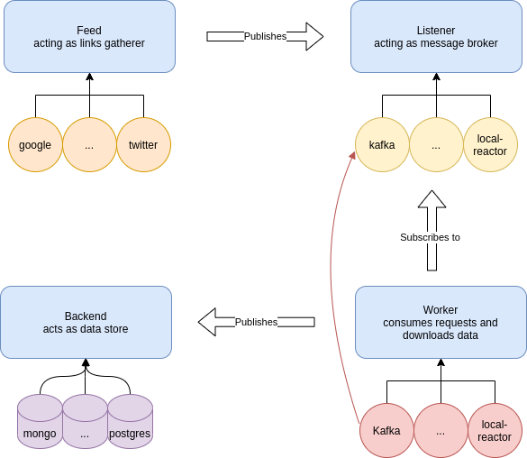

- [Description](#description)
- [Basic Architecture](#basic-architecture)
- [Basic Usage](#basic-usage)
  - [Example](#example)
  - [TODO](#todo)


## Description
scraper is a distributed and versatile data crawler.

## Basic Architecture
A feed requires the following three component to run properly
1. listener: It could be a messaging bus such as rabbitmq or kafka 
2. worker: subscribes to a listener and downloads the page content and stores it into a backend.
3. backend: a redis or nosql backend to store the final data



## Basic Usage
### Example 
```python
from scraper.feeds.google_feed import GoogleFeed
from scraper.listeners.reactor_listener import ReactorListener
from scraper.backends.memory_backend import MemoryBackend
from scraper.workers.reactor_worker import ReactorWorker

backend = MemoryBackend(loop=loop)
worker = ReactorWorker(backend=backend)
listener = ReactorListener(worker=worker)
google_feed = GoogleFeed(listener=listener)

async with google_feed.boot() as feed:
    await feed.search_cmd(['BTC'])
```

### TODO
- Document the code
- Put producers and consumers in separate event loops to allow for better concurrency 